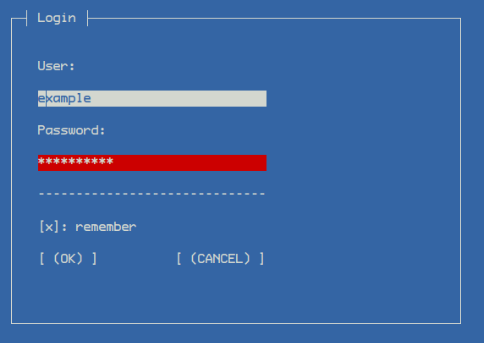

"wrap_ncurses" is a small library written in C++ that takes advantage of the powerful "ncurses" (new curses) library for drawing simple graphical interfaces on
terminal.

This project was born only for hobby without any particular claim. 
It is a simple study project.

You can check the actual presence of "ncurses" in your Linux by typing the
command:

	ldconfig -p | grep ncurses
  
or:

	sudo apt list libncurses*

If ncurses is not present it is possible to install it with the command:

	sudo apt-get install libncurses-dev
  
or:

	sudo apt-get install libncurses5-dev libncursesw5-dev
	
For any information on ncurses you can use the site:

	https://invisible-island.net/ncurses/announce.html

To compile / link your project it is necessary to insert the switch: -lncurses

Specific:

To draw a gui on terminal wrap_ncurses needs some parameters:

1) The C++ source must include:
	
		#include "wrap_ncurses.hpp"
		
		// and eventually
		using namespace wn;

2) Call "init_main_window":

	
	init_main_window(TRUE, "DEMO");
  

3) Define a tree structure of type "wn::Container", example:
		
		
		wn::Container *conf = WN_CONTAINER("demo")->
                          ADD_WINDOWS(
    		"1", {
        		WN_WINDOW(1, 1, 1, 60, 10, "1", true, 1, true,
        		{
            			WN_LABEL    (2, 2,  3, 5,  1, "1: "              ),
            			WN_TEXT     (3, 6,  3, 5,  1, "2"                ),
            			WN_LABEL    (4, 25, 3, 5,  1, "3: "              ),
            			WN_TEXT     (5, 29, 3, 15, 1, "4"                ),
            			WN_LABEL    (6, 2,  5, 5,  1, "5: "              ),
            			WN_TEXT     (7, 6,  5, WN_RATIO(50) + 10, 1, "test"),
            			WN_CHECKBOX (8, 2,  8, 12, 1,  ": checkbox", true  )
        		}),
        		WN_WINDOW(9, 1, 12, 60, 10, "2", true, 1, true,
        		{
            			WN_LABEL(10, 2, 3, 5, 1, "name: "),
            			WN_TEXT (11, 8, 3, 5, 1, "surname: ", 3),
        		})
    		  });
          
          // Indicate the window to load, in this example the "1":
          load_main_ui_config_name("1");  
          load_main_ui_config_data(conf);
  
          run_app();

The WN_CONTAINER factory creates and returns a pointer of type wn::Container where it is
It is possible to indicate multiple Windows, each one can contain different components.

For more details, look at the "examples" folder.

	
